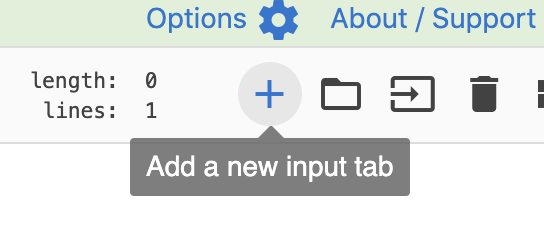
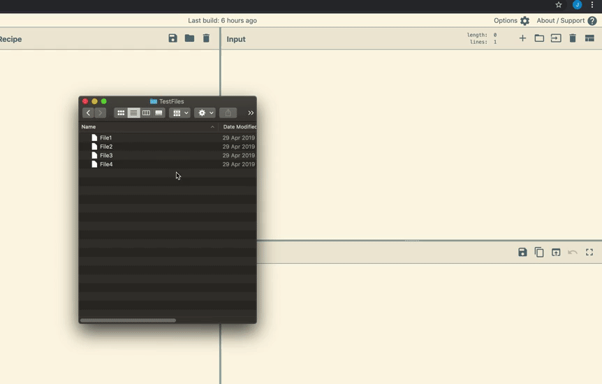
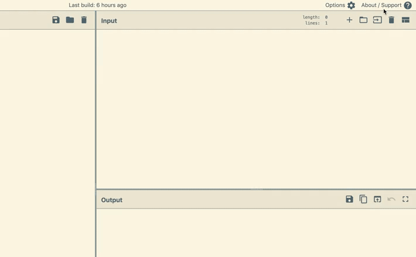
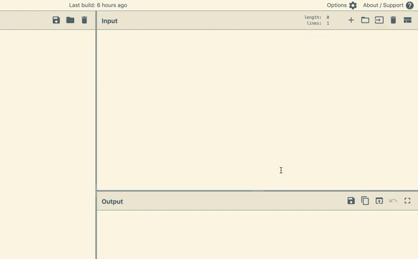
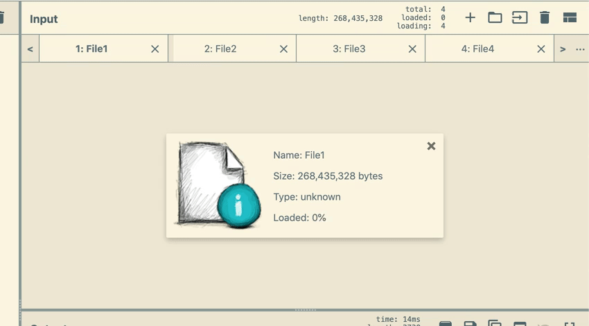
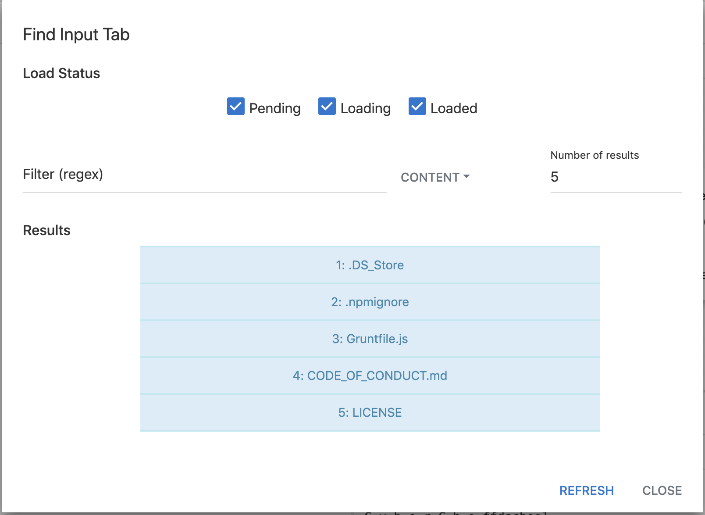

As of CyberChef v9, it's possible to run a recipe over multiple different inputs simultaneously.

## How to
### Add tabs
To add a new input tab, click on the `Add a new input tab` button in the input title bar.

This will create a new blank input tab, which you can type and paste data into.
> You don't need to create a new tab before loading files, as new tabs will be created automatically

### Load Files
#### Drag and drop
Like in previous versions of CyberChef, a file can be loaded by dragging and dropping it into the input area. You can drag and drop multiple files in the same way to load multiple files as inputs.

#### Open file button
The `Open file as input` button now supports selecting mutliple files. Click on the button, select multiple files in the dialog that opens, and each of the selected files will be opened as a separate input.

#### Open folder button
The `Open folder as input` button functions much like the open file button, except you select a folder to open instead of individual files. All of the files from inside the folder will be loaded, including subfolders.
> This will also select hidden files, or metadata files such as `.DS_Store` on Mac OS.

> Both Chrome and Firefox load the file handles in the background before passing them to CyberChef, so there may be a delay between clicking `Upload` and anything happening on screen.

#### Load status
The overall load status is displayed in the input title bar. The total number of inputs being loaded is displayed, along with the number of inputs which are pending being loaded and the number of inputs which have been loaded.
> The load progress of each tab is displayed by using the tab header as a progress bar.

> The title of input tabs is either the first few characters of the input or, if it's a file, the filename.

### Baking
When autobake is triggered (e.g. when changing the recipe or the input contents), only the currently displayed input tab is baked.
To bake all inputs, click on the `Bake!` button to initiate a full bake.

> If an input hasn't been fully loaded when Bake is clicked, the input will be ignored.

#### Bake status
The bake status is displayed in the output title bar. Displayed statistics are: the total number of inputs being baked, the number of pending inputs, and the number of inputs which have finished being baked.
> The progress through the inputs is also displayed by turning the bake button into a progress bar!

> The background of each tab is used as a progress bar to display the invidual progress through the recipe.

#### Canceling a bake
While a bake is in progress, you can click on the bake button again (now labelled `Cancel`) to cancel the bake, where any inputs currently being baked or pending will be cancelled. Any inputs which have completed baking will keep their new outputs.

### Output tabs

### Searching for tabs
To search for input or output tabs, click on the menu button to the right of the tab bar (`···`) and click `Find tab`. Use the status checkboxes to filter load or bake status, and the filter box to match the contents (or input filename) of each tab against a regular expression. Click on a search result to open that tab.

> If you know the number of the tab you want, you can use the `Go to tab` button in the tab menu to jump to it directly

### Downloading outputs
To download an individual output, click on the `Save output to file` button in the output title bar.

To download all outputs in one zip file, click on the `Save all outputs to a zip file` button in the output title bar. When this is clicked, you will be asked for a filename for the zip file, as well as a file extension for the zipped files.
> If the file extension is left blank, CyberChef will try to automatically detect the file extension for each input (`.dat` will be used if it can't be detected).

### Keyboard shortcuts
- Add Tab
    - **Windows & Linux:** Ctrl + Alt + T
    - **Mac:** Ctrl + Option + T
- Remove Tab
    - **Windows & Linux:** Ctrl + Alt + W
    - **Mac:** Ctrl + Option + W
- Go to next tab
    - **Windows & Linux:** Ctrl + Alt + Right arrow
    - **Mac:** Ctrl + Option + Right arrow
- Go to previous tab
    - **Windows & Linux:** Ctrl + Alt + Left arrow
    - **Mac:** Ctrl + Option + Left arrow

### Notes
When using multiple inputs, there are some limitations to be aware of:
- CyberChef can be very CPU intensive when loading and baking inputs, so either the browser or your entire computer may slow down as a result. To make the most of systems with multiple processing cores, CyberChef will attempt to spin up multiple threads to handle the different inputs (this number is calculated as the number of available cores minus one, to make sure the UI does not become unresponsive).
- On low memory systems, Firefox may frequently run out of memory to use and close the tab.
- On Windows systems, Chrome does not allow a browser tab to use more than around 2-3GB of RAM. If you try to load too much data into CyberChef, Chrome will close the tab.
- Both browsers can load up to around 500,000 files using the open folder dialog.
    - In Chrome, loading more than it can handle will instantly crash the entire browser.
    - Firefox silently cancels loading files if the number of files is above its limit.